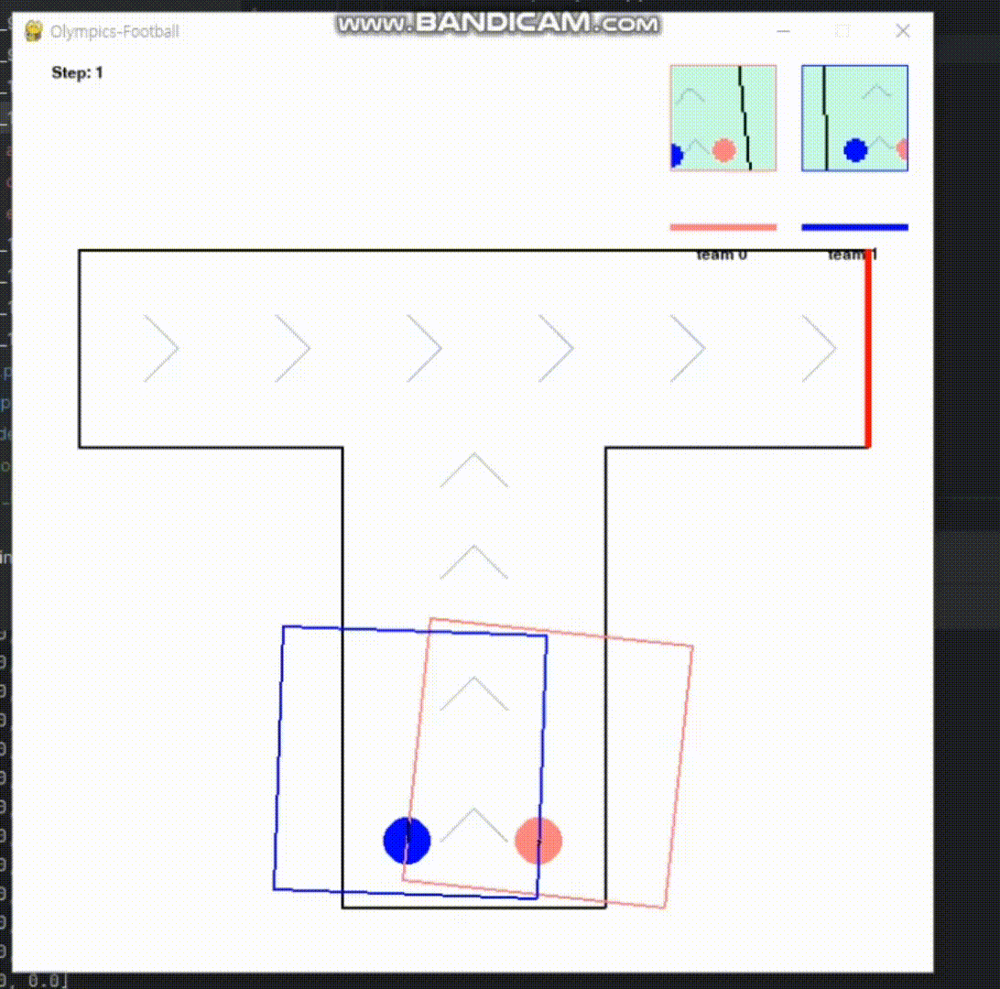

# AI Application Practice

## overview
The Running event in AI Olympics is a competitive environment where AI agents compete to reach the finish line faster than their opponent.

## Multi-Agent Game Evaluation Platform --- Jidi (及第)

## Game Rules
Two AI agents compete on a track.

The agent that reaches the finish line first wins.

An agent can also win by reducing the opponent's energy to zero.

### State
The environment provides state information in the following format:
state[agent_index]['obs']['agent_obs']
Represented as a 40x40 2D matrix.

Meaning of values:

Team 0: 10

Team 1: 8

Track: 6

Arrows: 4

Finish line: 7

### Actions
Agents can perform the following two actions:

Force: Adjust the acceleration of the car (-100 ~ 200)

Angle: Adjust the steering angle (-30 ~ 30)

### Rewards
Winning: +1

Otherwise: 0

### Environment Features
The track can have various shapes (circular, S-shaped, straight, etc.).

Agents must navigate obstacles and directional indicators to find the optimal path.

### Environment Rules
1. Each agent controls an elastic ball with the same mass and radius.

2. Agents can collide with each other or walls, potentially losing speed.

3. Each agent has a limited amount of energy, which is consumed based on applied force and displacement.

4. Energy regenerates at a fixed rate, but if it reaches zero, the agent can no longer apply force.

5. The game continues until all subgames are finished.

### References
Refer to the official AI Olympics documentation to better understand the environment and optimize strategies.

Reinforcement learning and optimal pathfinding algorithms can be used to enhance performance.
